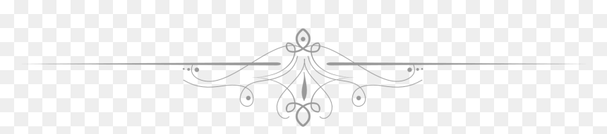

<h1 align = "center"> <i> "Do not let what you cannot do interfere with what you can do" <i> </h1>
  
  

  <h2> Who Am I? </h2>
  
  A third-year computer engineering student at An-Najah National University, an optimistic Palestinian girl from Nablus with aspirations of freedom from the   
    occupation. Loyal to my home country and constantly striving to be a part of the changes in it, I hope that someday I can raise the name of my country highly 
    through   my contributions, achievements in technological fields, and by helping those who are in need. In a way, I can be described as a moving fountain of 
    hope, I am always  looking for ways to make my life better, I never lose my passion for better days and better situations, and I like to observe these details 
    in my friends' hearts so I do my best not to leave them disappointed. Being a strong believer in Allah, the creator, I don't give up in this life because I know 
    Allah knows exactly what I'm going through. I am made stronger by the hardships in my life. Last but not least, I would like to note that I'm too determinant in 
    my appointments and I can work under pressure with high energy most of the time since I am constantly looking at what are the great outcomes lying beyond these 
    challenges, which keeps me motivated. Despite all the previous details, I'm not a perfect human, Perfection is an illusion, we all have an imperfect side, for 
    me I'm hesitant to take some decisions in certain situations, sometimes I get extremely annoyed but I somehow manage to pass through all these things smoothly. 
    Yes, It's me Israa Odeh. 

  <h2> From others' Perspective: Facts About Me </h2>
  
 These objective feedbacks were obtained from a small group of trusted people who know me as am I in my best and worst situations.      <b> I have asked
    them "Who is Israa?" Can you briefly describe both the positive and negative aspects of my personality? </b> 

  
  
  
  
  You are truly distinguished and are always direct and honest with
    the truth, you are kind, you are very diligent in your studies and excel at them with great dedication and persistence, you give yourself ample time to enhance
    your capabilities, anyway, I would mention that you have trouble controlling your nerves at times. <b> (Amal Odeh - Geography Teacher) </b>  

  
  
  
  
   A hard worker who accomplishes her tasks very accurately and who
    focuses on what she is doing, putting all her efforts into achieving the best possible results, but On the other hand, you are hasty in some situations of your
    life. <b> (Shahd Ismail - Computer Engineer) </b> 

  
  
  
  
   An ambitious person who strives to achieve goals despite
    obstacles, however, you are a hesitant person with multiple questions going in mind, and I see that you should stop justifying your reasons to the people around
    you. <b> (Yazeed Odeh - co-owner of a marble and granite factory) </b>  

  
  
  
  
   A diligent student whom I have known from the university, she
    spends tremendous efforts to reach a place where she could see that her dreams and goals exist. One of them is to graduate with immense familiarity within all
    areas of her specialization, so she goes through terrible times of pressure to achieve her visualized results, from what I have observed, it seems that even
    your physical and mental health isn't as important as your studies are to you! I like how you think outside the box, by including so many areas of life in your
    knowledge, regardless of their direct relationship to your major. It's a pleasure to deal with you since you spread positivity so effectively and you are a
    cultured student. When you cross over lines, you do not blame others for your failures, but rather deal with their consequences, which makes you a unique human
    as well as a student. <b> (Yasmeen Sarah - Civil Engineer) </b> 

  
   
  
  
   Beautiful inside and out, kind, like to share what you feel and
    express what you think, generous, and has the desire to help others even if it is at the cost of your fatigue. I feel that you are a conscious and understanding
    person who knows what she is doing in her life and likes to work with people in an official manner. You do not like them to become used to you, and do not get
    used to them excessively. No matter what, you will always be on the right side because you are courageous. Encouragement and motivation from others are
    invigorating and inspiring to you. You care deeply about studying, and you are very diligent in this regard since you have a goal to achieve in life, and God
    willing, you will achieve it. You love to be distinguished from others even in your attire. I like many of your qualities, but I dislike some, namely that you
    sometimes seem rushed, that you can be harsh when you get angry, that you do not have patience in some situations, and that you do not like to discuss some
    topics, even when you aren't right from others' perspectives, but never mind if you're convenient in what you are doing.
    you. <b> (Alaa Khuffash - Health Manager) </b> 

  
  
  
  
  
   My best friend Israa, an ambitious, persistent, hard-working
    girl, always thoughtful, calm, and likes doing good. <b> (Ruba Ridi - Information Systems Manager) </b> 

  
  
 
  
  <h2> My Goals & Vision </h2>
  
 As life and experiences sharpen the interests and orientations of each individual, I believe these goals are representative of my current orientation in life,
    which could be changed based on my progress in my life, the experiences I pass through, and the knowledge gained in different facets of life. So perhaps as an
    undergraduate I find the following goals most attractive, but in the future, they may be completely different. 

  
  
  
   Earning my master's degree in battery power consumption enhancements.
  

  
  
   A Ph.D. in a field relevant to the improvement of battery behavior.
  

  
  
   If accepted, contribute yearly to an open-source project through GSoC
    or other programs. 

  
  <h2> Skills </h2>
  
 As a computer engineering student, I should have a wide range of skills encompassing both hard and soft skills. I have a lot of skills but have not yet
    achieved a sufficient level; in this field of study, you will never stop fixedly at a specific stair; you will always be climbing.     

  
  
  <b> Soft Skills </b> 

  
  Teamwork: Generally, I enjoy working alone, however I
    have participated in many teamwork projects at my university and I am aware and appreciative of the value of joining forces and working in partnership with
    others. 

  
  The ability to communicate clearly: I have verbal,
    written, and visual communication skills as I can speak clearly and concisely, and has the capacity to project positive body language and facial expressions,
    skillfulness in composing text messages, reports, and other types of documents. 

  
  Leadership: I can supervise and direct my colleagues in
    university. 

  
  Effective time-management 

      
  Active listening 

  
  Problem-solving 

    
  Active Learner 

  
  Creativity     

  
  
  <b> Hard Skills </b>   Due to my background in computer
    engineering, I have extensive knowledge of different languages and enjoy problem-solving and programming. Among my other technical skills are the following:
  

  
  Familiar with HDLs (Hardware Description Languages) such as
    Verilog and VHDL 

  
  Familiar with low level languages such as Assembly, MIPS and
   SPIM 

  
  Basics of DIP (Digital Image Processing) techniques 

  
  Familiar with basic concepts of networks 

  
  Software Development 

  
  Relational Databases 

  
  Mathematical Skills 

  
  Web Development  

  
  Linux Basic Skills 

  
  <h2> Programming Languages </h2>
  <h2> Tools </h2>
  <h2> Sample Projects </h2>
